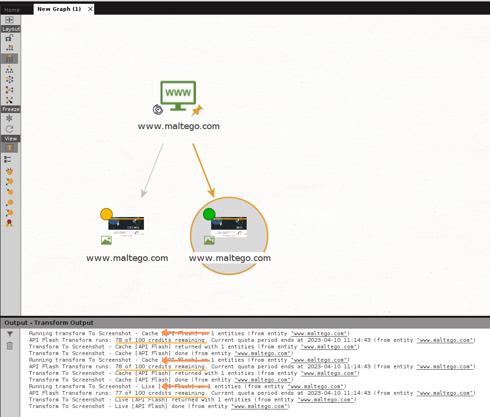
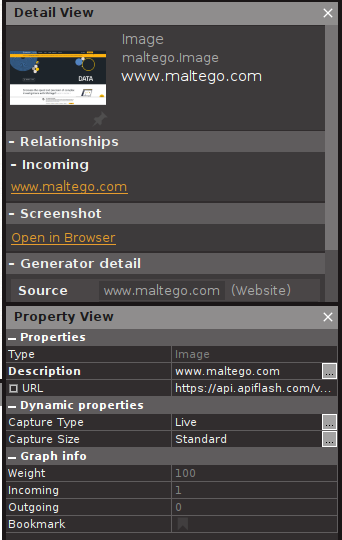
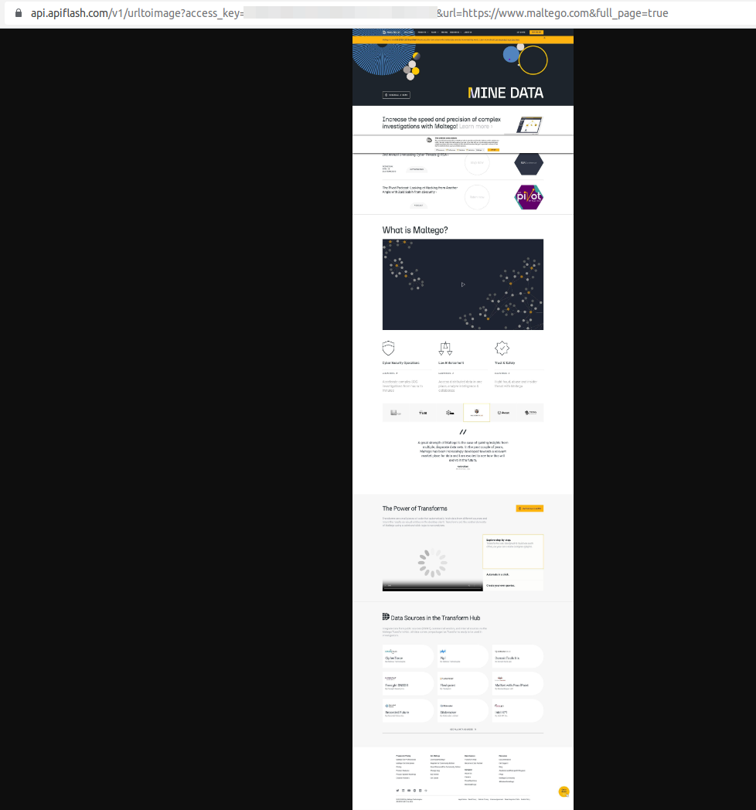
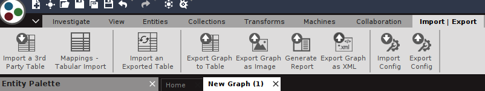
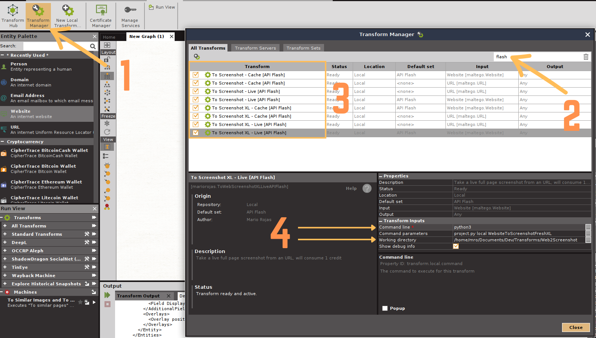
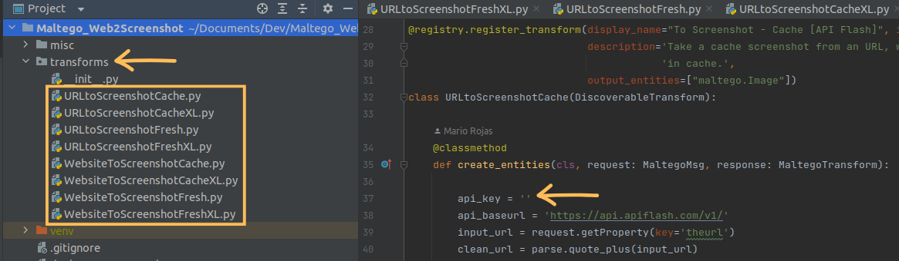

# Maltego Web2Screenshot Transforms

The Maltego Web2Screenshot Transforms allow you to generate screenshots from both Websites and URLS.

To use these Transforms you will need an API Key from [API Flash](https://apiflash.com/) they have a Free tier that
gives you 100 Credits per month (1 credit per screenshot).

## The Transforms

There are 8 available Transforms (4 per input type)

- **To Screenshot - Cache [API Flash]** : Retrieve a cached screenshot of a URL or Website, will consume 1 credit if not 
available in cache.
- **To Screenshot - Live [API Flash]** : Take a live screenshot from a URL or Website, will consume 1 credit.
- **To Screenshot XL - Cache [API Flash]** : Retrieve a cached full page screenshot from a URL or Website, will consume 1 
credit if not available in cache.
- **To Screenshot XL - Live [API Flash]** : Take a live full page screenshot from a URL or Website, will consume 1 credit.

## Capture Type

There are 2 capture types available.

1. **Live**: This will request a live screenshot from API Flash which will consume 1 credit.
2. **Cache**: This will check first if you have taken the screenshot for the specific input before, if available it will 
retrieve that copy without consuming credits, if not available, a live screenshot will be taken consuming 1 credit.

After a screenshot is retrieved, you can visually distinguish between the live and cached captures by the overlay colors 

- **Green:** Live capture
- **Yellow:** Cache capture

## Capture Size

There are 2 capture sizes available, both cost 1 credit each.

1. **Standard**: This will take a screenshot of the target without scrolling down the page.
2. **XL**: This is a full page screenshot, API Flash will attempt to scroll down the page before saving the image.

Both Transforms will give you the option to open the image on your Browser, which can be found in the Detail View

This would be specially useful for the XL screenshots.

Zooming in will allow you to view the capture as if it was the original site's size.

## Installation

A Maltego configuration file **Web2ScreenshotTransforms.mtz** has been included under the misc folder, you can simply 
import the file into your client by going to Import | Export > Import Config > Select mtz file.

Once the file has been imported, you will need to update the Command line and Working directory paths for the new 
Transforms.

Go to the Transforms Tab and follow the below steps for each Transform

1. Click Transform Manager
2. Search for Flash
3. Select one Transform at a time to perform step 4
4. Update the following fields
   - Command line: Path to your Python interpreter
   - Working directory: Path to this repository in your machine (should include the folder name) e.g. 
   TURROKS/Documents/Maltego_Web2Screenshot

Finally, you will need to manually add your API Key to the Transforms. Simply locate the Transform under the transforms
folder, open the file and add your key.

The configuration file includes a Transform set called "Web2Screenshot" which will arrange your new Transforms into a 
submenu, making them easier to find and use.

If you are a more advanced user and want to manually add the Transforms to your client, you can follow this 
[instructions](https://docs.maltego.com/support/solutions/articles/15000017605-local-transforms-example-#adding-the-transform-to-maltego-0-6)

**Note:** At the time of writing the Transforms I noticed the URL Entity's property that hold the url has changed it's 
unique name from url to theurl, if you don't get any results when running the URL to Screenshot Transforms could be due 
that change.

To fix this issue you can try refreshing your client or simply change the property name called **input_url** inside the 
Transforms (it's below the line where you added your API Key)

Happy OSINTing!